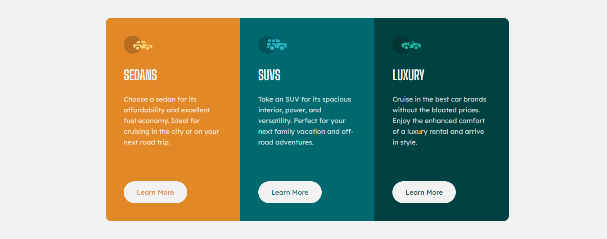

# Frontend Mentor - 3-column preview card component solution

This is a solution to the [3-column preview card component challenge on Frontend Mentor](https://www.frontendmentor.io/challenges/3column-preview-card-component-pH92eAR2-). Frontend Mentor challenges help you improve your coding skills by building realistic projects. 

## Table of contents

- [Overview](#overview)
  - [The challenge](#the-challenge)
  - [Screenshot](#screenshot)
  - [Links](#links)
- [My process](#my-process)
  - [Built with](#built-with)
  - [What I learned](#what-i-learned)
  - [Continued development](#continued-development)
  - [Useful resources](#useful-resources)
- [Author](#author)
- [Acknowledgments](#acknowledgments)


## Overview

### The challenge

Users should be able to:

- View the optimal layout depending on their device's screen size
- See hover states for interactive elements

### Screenshot



### Links

- Solution URL: [Solution](https://github.com/Sazid99246/3-column-preview-card-component)
- Live Site URL: [Live Site](https://your-live-site-url.com)

## My process

### Built with

- Semantic HTML5 markup
- CSS custom properties
- Flexbox
- CSS Grid
- Mobile-first workflow

### What I learned

```css
.box a{
      transition: all 0.4s ease-in-out;
}
```
### Continued development

- CSS Animation
- CSS Grid

### Useful resources

- [CSS Animation](https://www.w3schools.com/css/css3_animations.asp) - This helped me for making animation. I really liked this pattern and will use it going forward.

## Author

- Github - [Sazid99146](https://github.com/Sazid99246)
- Frontend Mentor - [@Sazid99246](https://www.frontendmentor.io/profile/Sazid99246)

## Acknowledgments

- [Mr. Coder](https://youtu.be/5DAvEEKfTEE)